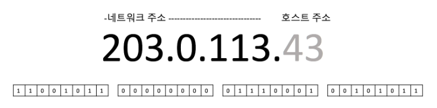
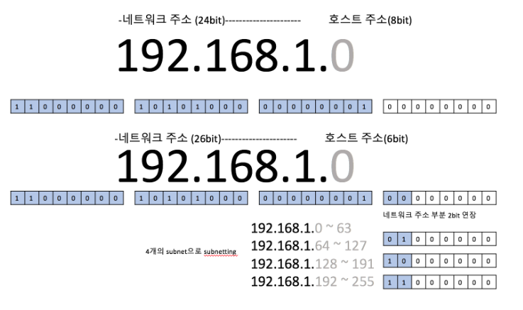
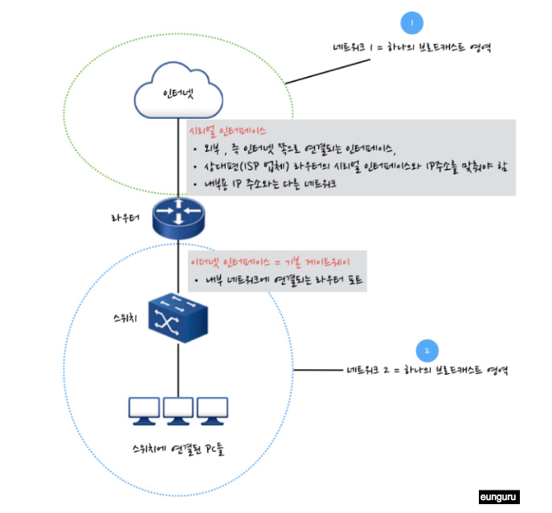

# NetWhat 

## IP
 * IP(Internet Protocol)는 인터넷상에 있는 개별 네트워크끼리 패킷을 라우팅하는 프로토콜이다.
   이 프로토콜을 이용하여 다른 네트워크에 있는 컴퓨터와 통신할 수 있다. Layer 3 network 레이어의 대표 프로토콜이다.
 * 호스트(컴퓨터)에서 호스트까지의 통신을 책임진다. Process data unit은 패킷(packet)이다.


## IP주소가 무엇인지
> 컴퓨터 네트워크에서 장치(호스트)들이 서로 인식하고 통신하기 위해 사용하는 주소
(IP 통신에 필요한 고유 주소)

  * IP 주소는 보통 네개의 영역이 점으로 된 분리된 십진수 형식으로 표현된다.
    ex) 192.168.123.132
  * 옥텟(Octet) : 8bit(자리) 마다 .(dot)을 찍어 구분, 마지막은 점을 찍지 않는다.
    (IP 주소는 4개의 옥텟, 32비트로 구분)
  * 32bit(자리)로 이루어진 2진수, IP는 네트워크 영역과 호스트 IP로 구성된다.
    동일한 네트워크 내에서는 호스트 IP는 각자 달라야한다
    * 네트워크 주소는 특정 네트워크의 주소이고 라우팅시 사용한다. 호스트 주소는 네트워크에 속한 호스트의 주소이다.
    * 여기서 하나의 네트워크란 하나의 브로드캐스트 영역이라고 생각하면 된다. 라우터를 거치지 않고도 통신이 가능한 영역.
    * 이 네트워크 주소 부분의 비트를 1로 치환한 것이 그 네트워크의 넷마스크이다.


```
  IPv4 (32bit): 일반적으로 사용하는 IP주소 (0.0.0.0 ~ 255.255.255.255 형태)

  IPv6 (128bit) :IPv4의 고갈로 크기를 128로 늘린 IP주소

  루프백 주소(loop back)
    - 호스트 자신을 가리키는 IP 주소(127.0.0.1)
    - 프로그램을 빠르게 테스트 하는 용도로 사용
```


#### 참고)

IP주소가 필요한 이유

  * 서로간의 통신을 위해서 구분할 수 있는 주소가 필요하다.

일반적으로 IP 주소를 IP라고 부르는 경우가 있지만, IP라는 것은 통신 프로토콜 자체를 의미하는 것이다.
IP 주소는 인터넷 상에서 데이터를 주고 받을 때 사용되는 주소이므로 혼동하지 말아야 한다.


IP = 프로토콜

IP 주소 = 주소

**한 마디로 IP 주소는 IP에 의한 패킷 교환을 위한 컴퓨터의 네트워크 상의 고유 주소이다.**


<br/>

**참고 링크)**

[IP,Netmask,Subnet,CIDR](https://juner417.github.io/blog/network-101-ip-subnet/)  

<br/>

---

## Netmask가 무엇인지

### Netmask (넷마스크)

* 하나의 네트워크를 몇 개의 네트워크로 나누어 사용할 때 나눠진 각각의 네트워크를 구분하기위해 사용하는 특수한 bit

* 네트워크 주소 부분의 비트를 1로 치환한 것이 넷마스크이다.
* IP 주소와 넷마스크를 AND 연산하면 네트워크 주소를 얻을 수 있다.

```
203.0.113.43 (네트워크주소: 203, 호스트주소 : 43)
== 11001011 00000000 01110001 00101011

255.255.255.0 (넷마스크)
== 11111111 11111111 11111111 00000000

AND 연산
-> 11001011 00000000 01110001 00000000
```

##### 참고)

AND 연산
  ```
  0 0 -> 0
  0 1, 1 0 -> 0
  1 1 -> 1
  ```

<br/>

---

## Netmask를 가진 IP의 서브넷이 무엇인지

### 서브넷(subnet) / Subnetmask
>여러 조합이 나올 수 있는 `IP 주소의 대역`을 `나누기` 위한 보조적 성격의 주소체계

  * 서브넷은 말 그대로, 작은(혹은 아래의) network,
    즉, 하나의 네트워크를 쪼개만든 네트워크이다. (하나의 네트워크는 또 한번 여러 서브넷으로 나뉠 수 있다.)
  * IP 주소에 대한 네트워크 아이디와 호스트 아이디를 구분하기 위해서 사용된다.
  * IP주소와 똑같이 32bit의 2진수로 되어 있으며, 8bit(1byte)마다 .(dot)으로 구분하고 있다.
  * 서브넷화 하는 경우 네트워크 주소 부분의 비트를 연장한다. 그리고 나머지 호스트 부분이 호스트 식별자가 된다.

  **주의!**
  형태가 똑같다고 해서 역할을 혼동하면 안 된다.
  형태가 똑같은 이유는 IP 주소와 서브넷 마스크를 AND 연산하기 위해서 이다.


```
맨 앞에 비트부터 1이 연속된 구간까지를 공통 비트로 처리하여 네트워크 아이디로 사용하고
O으로 끝나는 마지막 구간까지를 공통으로 하지 않는 비트로 처리하여 아이디로 사용한다.
```



|IP 주소| 서브넷 마스크| 네트워크 아이디| 호스트 아이디| IP 주소 개수|
|---|---|---|---|---|
|13.13.10.1|255.0.0.0|13.|.13.10.1|2^24개|
|13.13.10.1|255.255.0.0|13.13|.10.1|2^16개|
|13.13.10.1|255.255.255.0|13.13.10.|.1|2^8개|
|13.13.10.1|255.255.255.255|13.13.10.1|-|2^0개|
|0.0.0.0|0.0.0.0|-|0.0.0.0|2^32개|

### 표기법

### CDIR 표기
Classless Inter-Domain Routing(CIDR, 사이더)
* 클래스 없는 도메인 간 라우팅 기법으로 최신의 IP 주소 할당 방법이다.
* 사이더는 기존의 IP 주소 할당 방식이었던 네트워크 클래스틑 대체하였다.
* ip 주소 뒤에 / 로 구분하고, 서브넷마스크의 비트수를 적어 표시하는 것을 CIDR 표시법이라 부른다.

```
  255.000.000.000 == 11111111 00000000 00000000 00000000 == /8
  255.254.000.000 == 11111111 11111110 00000000 00000000 == /15
  255.255.255.255 == 11111111 11111111 11111111 11111111 == /32
```
 슬래시 뒤에 2진수 표기 일때, `1`인 비트 수를 써서 표기 할 수 있다.


#### 참고)

#### 서브넷 사용이유

  * 호스트들이 넓은 범위에 흩어져 있는 경우, LAN의 확장에는 한계가 있으므로 지역별로 네트워크를 다르게 구성해야 한다.
    이럴때 가까운 지역의 호스트 끼리 서로 묶는 역할로 서브넷 네트워킹을 사용한다.
  * 네트워크 트래픽이 높아 통신 속도가 저하되었을때, 서브 네트워크로 분리함으로써 통신 속도를 향상 시킬 수 있다.
  * 보안이 필요한 내용들을 보호해야할 때, 서브 네트워크를 통해 별도로 관리할 수 있다.

<br/>

---

## 서브넷의 브로드캐스트 주소가 무엇인지

  * 네트워크 주소 : 하나의 네트워크를 통칭하기 위함

    * 해당 네트워크의 첫번째 IP주소
    * 계산 방법:
      IP주소와 서브넷 마스크를 `AND` 논리곱 연산한 것

  * 브로드캐스트 주소 : 하나의 로컬 네트워크에 전체에 있는 클라이언트 모두에게 데이터를 보내는 방식

    * 해당 네트워크의 마지막 IP주소
    * 계산 방법 :
      서브넷 마스크의 `0`으로된 비트를 모두 `1`로 바꾸어 준 것

    * ARP, DHCP, RIP 등의 프로토콜에 사용된다.

  ex)
  계산 방법
  ```
    IP           : 121.160.25.92
    서브넷 마스크 : 255.255.255.128

    - 10진수 -> 진수

    IP           : 01111001.10100000.00011001.01011100
    서브넷 마스크 : 11111111.11111111.11111111.10000000


    - IP와 서브넷 마스크 AND(논리곱)

    네트워크 주소 : 01111001.10100000.00011001.00000000
                   == 121.160.25.0


    - 서브넷 마크스 마지막 1 뒤의 0 위치부터 다 1로 바꿈

    브로드 캐스트 : 01111001.10100000.00011001.01111111
                   == 121.160.25.127

  ```

<br/>

---

## Netmask를 가진 IP 주소를 표현하기 위한 여러가지 방법이 무엇인지

### CDIR 표기
Classless Inter-Domain Routing(CIDR, 사이더)
* 클래스 없는 도메인 간 라우팅 기법으로 최신의 IP 주소 할당 방법이다.
* 사이더는 기존의 IP 주소 할당 방식이었던 네트워크 클래스틑 대체하였다.
* ip 주소 뒤에 / 로 구분하고, 서브넷마스크의 비트수를 적어 표시하는 것을 CIDR 표시법이라 부른다.

```
  255.000.000.000 == 11111111 00000000 00000000 00000000 == /8
  255.254.000.000 == 11111111 11111110 00000000 00000000 == /15
  255.255.255.255 == 11111111 11111111 11111111 11111111 == /32
```
 슬래시 뒤에 2진수 표기 일때, `1`인 비트 수를 써서 표기 할 수 있다.


<br/>

---

## 공인 IP와 사설 IP의 차이점이 무엇인지

  * 공인 IP 주소 :
    Public IP Address
    인터넷과 같은 공인 환경에 직접 연결이 가능한 IP 주소를 의미한다.
    즉, 인터넷을 하기 위해서는 공인 IP 주소가 필요하고, 이 주소는, ISP 업체로 부터 임대를 받아서 사용해야 한다.
  * 사설 IP 주소 :
    Private IP Address
    공인 환경이 아닌 기업 내부 사설 환경에서 사용을 권장하는 주소이다.
    이 주소는 인터넷과 연결되지 않기 때문에(WAN 구간을 연결하는 Router는 사설 IP 주소를 외부로 전송할 수 없다)
    다른 환경과 중첩하여 주소 범위를 사용해도 무관하며 ISP 업체로부터 임대를 받지 않아도 사용할 수 있다.
    내부 네트워크에서만 사용하는 IP 주소, 인터넷 사용할 수 없음(폐쇄형)

    *  사설 IP 주소는 주소 대역이 다음 3가지로 고정된다.
    ```
      Class A : 10.0.0.0 ~ 10.255.255.255
      Class B : 172.16.0.0 ~ 172.31.255.255
      Class C : 192.168.0.0 ~ 192.168.255.255
    ```

<br/>

---

## IP 주소의 클래스가 무엇인지

  * 클래스는 하나의 IP주소에서 네트워크 영역과 호스트 영역을 나누는 방법이자, 약속이다.
    클래스는 IP주소의 타입이라고 생각 할 수 있다.


  * IPv4 에는 총 5가지 클래스가 있다. A, B, C, D, E
    (D, E 클래스는 멀티캐스트용, 연구용으로 사용되기 때문에, A B C 만 알고 있으면된다.)


<br/>

  A Class
  * IP주소를 32자리 첫 번째 필드 2진수로 표현(변환)했을때, `맨 앞에 0`이라는 공통 비트를 갖는다면 A Class로 정의한다
   (00000000 ~ 01111111 즉 0부터 127까지)

    - A 클래스의 IP주소는 첫 번째 옥텟이 0 ~ 127.
    - **사설 IP**는 10.0.0.0 ~ 10.255.255.255.

  B Class
  * 첫 번째 필드를 2진수 변환할 경우 `맨 앞에 10`이라는 공통 비트를 갖는다면 B Class로 정의한다. (10000000 ~ 10111111 즉, 128 ~ 191까지)

    - B 클래스의 IP주소는 첫 번째 옥텟이 128 ~ 191.
    - **사설 IP**는 172.16.0.0 ~ 172.31.255.255

  C Class
  * 첫 번째 필드를 2진수 변환할 경우 `맨 앞에 110`이라는 공통 비트를 갖는다면 C Class로 정의한다. (11000000 ~ 11011111 즉, 192 ~ 223까지)

    - C 클래스의 IP주소는 첫 번째 옥텟이 192 ~ 223.
    - **사설 IP**는 192.168.0.0 ~ 192.168.255.255


<br/>

---

## TCP가 무엇인지

### TCP
Transmission Control Protocol
  * 전송 제어 프로토콜, IP와 함께 TCP/IP라고도 불린다.
  * 일련의 옥텟을 안정적으로, 순서대로, 에러없이 교환할 수 있도록 해준다.
  * 정확도나 보안을 중요하게 생각하는 프로토콜

<br/>

  * 사용

    * 웹브라우저에서 www 연결, 이메일 전송, 파일전송 등

  * 특징)  
    * 연결형 프로토콜
    * 데이터 패킷 순서 기억
    * 속도가 느림
    * 헤더 사이즈: 20 바이트
    * 무거움. 데이터 전송 전 3개의 패킷을 이용하여 소켓을 연결해야함
    * 에러를 체크하고 복구 또한 시도
    * SYN, SYN-ACK, ACK 같은 핸드쉐이크 프로토콜 사용
    * 목적지로 데이터 전송을 보장
    * 플로우 컨트롤 제공을 통해 에러 핸들링이 가능
    * 브로드캐스팅 불가

<br/>

---

## UDP가 무엇인지

### UDP
User Datagram Protocol
  * 사용자 데이터그램 프로토콜
  * 전송방식이 단순하여 순서가 바뀌거나 중복되거나 통보없이 누락되기도 한다.
  * 정확도나 보안을 포기하는 대신 속도가 굉장히 빠르다고 볼 수 있다.

<br/>

  * 사용

    * DNS, IPTV, VoIP, 온라인게임 등

  * 특징)
    * 비연결 프로토콜
    * 연결이 불필요하기에 일 대 다 전송 가능
    * 패킷은 모두 독립적. 순서는 따로 기억하지 않음
    * 속도는 빠르며 에러 복구는 없음
    * 헤더 사이즈: 8 바이트
    * 가벼움. 연결을 트래킹하지 않음
    * 에러 체크를 하지만 문제가 있는 패킷은 버림
    * 핸드쉐이크 없음.
    * 데이터 전송을 보장하지 않음
    * 하나의 에러 체크 시스템만을 보유
    * 브로드캐스팅 가능


#### 비교)

#### 전송계층
|TCP |UDP |
|--- |--- |
| 양단 간 연결 설정하여 양방향 데이터 전송  | 연결 설정하지 않고 단방향 데이터 전송  |
| 브로드캐스팅 불가능   |  브로드케스팅 가능  |
| 수신확인 가능   | 수신확인 불가능    |
| 정렬을 위해 순서 재조립   | 순서예측 불가  |

<br/>

---

## 네트워크 계층이 무엇인지

>데이터를 목적지까지 가장 안전하고 빠르게 전달하는 기능을 담당한다.
>라우팅 패킷 포워딩을 담당한다.


* 여러 개의 노드를 거칠 때마다 경로를 찾아주는 역할을 하는 계층으로 다양한 길이의 데이터를 네트워크들을 통해 전달하고, 그 과정에서 전송 계층이 요구하는 `서비스 품질`(QoS)을 제공하기 위한 기능적, 절차적 수단을 제공한다.

즉, 어디로 연결이 되어야 목적지에 도달할 수 있을지를 고민하고 `패킷`을 `전송`하는 것과 관련된 계층이라고 할 수 있다.

그런 이유로 `라우팅`이나 `IP`도 이 계층의 프로토콜에 속한다.


ICMP (Internet Control Message Protocol)

* 인터넷 제어 메세지 프로토콜
* 네트워크 컴퓨터의 OS에서 오류 메시지를 전송받는 데 주로 쓰임
* 'Echo request', 'Echo reply', 'Destination Unreachable', 'Time Exceeded' 등
* 사용 : 핑(Ping), 트레이스라우트(traceroute)

<br/>

---

## OSI 모델이 무엇인지

> OSI 모델은 컴퓨터 네트워크와 관련하여 각종 프로토콜과 관련 기술을 계층으로 분리하여 정리한 것이다.

상위계층과 하위계층으로 구분되며, 세부적으로 7가지 계층으로 구성되어있다.

* 하위 계층 : 물리 계층, 데이터 링크 계층, 네트워크 계층, 전송계층
* 상위 계층 : 세션 계층, 표현계층, 응용 계층

| 구분 | 계층 |  | 예시 |
|---|---|---|---|
|1 |물리 계층 | Physical Layer| |
|2 |데이터링크 계층| Data linke Layer |  이더넷|
|3 |네트워크 계층 | Network Layer| IP, ICMP|
|4 |전송 계층 | Transport Layer| TCP, UDP|
|5 |세션 계층 |Session Layer | TLS/SSL|
|6 |표현 계층 | Presentation Layer| |
|7 |응용 계층 | Application Layer| DNS, DHCP, HTTP|


#### 계층을 나누어 정리한 이유

* 통신이 일어나는 과정을 단계별로 알 수 있고, 특정한 곳에 이상이 생기면 그 단계만 수정할 수 있기 때문이다.
  통신 중 문제가 발생할 때, 문제가 일어나는 부분만을 살펴보면 되므로 유용하다.


<br/>

---

## DHCP 서버 와 DHCP 프로토콜이 무엇인지
> DHCP 어떤 IP주소를 특정 웹사이트의 이름에 할당해줄지를 결정하는 프로토콜이다.

* PC사용자에게 IP주소, 서브넷마스크, 게이트웨이 주소, DNS와 같은 정보를 자동으로 할당해 주고, 사용하지 않으면 반환받아 다른 컴퓨터가 사용할 수 있도록 해줌

**`DHCP 서버`** 는 IP주소들의 풀(pool)과 클라이언트 설정 파라미터를 관리한다.
  새로운 호스트(DHCP 클라이언트)로부터 요청을 받으면 서버는 특정주소와 그 주소의 대여(lease) 기간을 응답한다.
  클라이언트는 일반적으로 부팅 후 즉시 이러한 정보에 대한 질의를 수행하며 정보의 유효기간이 해제되면 주기적으로 재질의한다.

**`DHCP 프로토콜`** 은 UDP패킷을 이용하는 비연결형 서비스 모델을 기반으로 한다.
  (비연결형 서비스란 TCP(TCP-IP)와 같은 연결을 위한 요청, 허락 등의 일련의 과정이 없이 목적지까지의 전송여부를 보장하지 않으며 필요한 경우 전송된 자료에 대한 신뢰성은 응용 프로그램에서 확인하는 방식이다.)


<br/>

---

## DNS 서버와 DNS 프로토콜이 무엇인지

### DNS
Domain Name System
* 네트워크에서 도메인이나 호스트네임을 숫자로 되어 있는 IP 주소로 해석해 주는 TCP/IP 네트워크 서비스를 말한다.
 (Domain을 IP로 변환하거나 IP를 Domain으로 다시 변경해 주는 것)
* www.google.com이라는 걸 입력받으면 .com 서버에 해당 주소가 어떤 IP주소와 연결되어 있는지를 찾아 그 주소의 데이터를 우리가 접근할 수 있도록 연결을 도와준다.

- DNS 메시지를 전달하귀 위해 하위 TransPort(전송) 계층의 프로토콜을 이용하므로 어플리케이션 계층 프로토콜이다.


**자세히)**

* 도메인 네임 시스템(DNS)는 네트워크에서 도메인이나 호스트 네임을 숫자로 되어 있는 IP 주소로 해석해 주는 TCP/IP 네트워크 서비스를 말한다.

* 도메인 네임은 인터넷 주소로 사람들이 기억하기 쉽게 붙여진 이름이지만 인터넷에서 컴퓨터가 이것을 찾기 위해서는 숫자로 된 IP 주소가 필요한데,
  각 사이트에서 운영되는 모든 호스트 서버는 고유 IP를 갖고 있으므로 사용자가 문자로 주소를 입력하면 DNS 서버를 통해 호스트 서버가 인식할 수 있는 IP로 변환되면서 접속이 가능해진다.

* DNS에는 도메인을 관리하는 네임서버와 Cache DNS로 나뉘는데 네임 서버라고 불리며 다시 Master Sever와 Slave Server로 구분된다.

* Master Sever는 인에 대한 주된 호스프 파일을 유지할 뿐만 아니라 호스트 정보 변경 및 추가가 가능하다.

* Cache DNS는 네임 서버에서 설정된 도메인 정보를 가져오는데 Master Sever가 하나를 권장하는 데 반해 여러 개가 존재할 수 있다.
  Cache DNS는 도메인에 대해서 Authority Data 없이 Resolving 처리를 위해서만 사용한다.

* 일반적으로 ISP DNS가 Cache DNS에 속합니다.

#### 참고)

[DNS](https://run-it.tistory.com/32?category=668092)

<br/>

---

## IP 주소를 사용하여 두 장치를 통신하기 위한 규칙이 무엇인지

* 전화번호가 지역번호, 국번 등으로 나누어 지는 것 처럼 IP주소도 네트워크 부분과 호스트 부분으로 나누어 진다.
  네트워크는 하나의 브로드캐스트 영역, 즉, 라우터를 거치지 않고 통신이 가능한 영역을 말하는 것이고,
  호스트는 PC및 장비 각각을 말하는 것이다.
* IP 주소에서 호스트 부분을 전부 0으로 한 것은 네트워크 자체.. 즉 네트워크 주소가 되고, 호스트 부분을 전부 1로 한 것은 그   네트워크의 브로드캐스트 주소가 된다.

[IP주소체계](https://yang1650.tistory.com/25)

<br/>

---

## 라우팅이 어떻게 IP와 함께 동작하는지

라우팅(Routing)

1. ip주소확인
2. 경로를 확인하고
3. 어느 인터페이스로 내보내야하는지 결정.
4. 결정한 인터페이스로 패킷 전달->다른 라우터에 도달
5. 1~4 반복. 목적지 네트워크에 도착할 때까지

[라우팅이란](https://bignet.tistory.com/26)


[동적라우팅, 정적라우팅](http://blog.naver.com/PostView.nhn?blogId=ssdyka&logNo=221068508093&parentCategoryNo=&categoryNo=11&viewDate=&isShowPopularPosts=true&from=search)

<br/>

---

## 라우팅을 위한 기본 게이트웨이가 무엇인지

기본 게이트웨이(Default Gateway)
> 기본 게이트웨이란 내부 네트워크에 없는 녀석을 찾아 밖으로 나갈 때 통해 있는 문이 되고, 이것은 바로 라우터의 이더넷 인터페이스 주소가 된다
>>통신을 할 때 상대방의 IP 주소를 찾아 우선 내부 네트워크를 먼저 뒤지고 만약 없다면 외부로 나가게 되는데, 내부 네트워크에서 통신을 할 경우에는 라우터가 필요 없지만 외부로 나가게 된다면 라우터를 통해 밖으로 나가게 된다. 이 때 밖으로 나가기 위해서는 라우터의 문을 통과 해야하는데 이 문이 바로 게이트 웨이이다.


* 내부 네트워크에서는 라우터 없이도 통신이 가능 (같은 브로드캐스트 도메인에서는 라우터 없이 통신 가능)
* 통신 시 목적지를 찾기 위해 내부 네트워크에서 먼저 찾음
  없을 경우 기본 게이트 웨이를 통해 외부 네트워크에서 목적지를 찾음 (라우터의 이더넷 인터페이스)
* 라우터에는 인터페이스 별로 각각 IP를 배정
* 스위차나 허브는 IP주로를 장비별로 하나씩만 배정
  (관리를 위한 것이지 IP주소를 배정하지 않아도 통신에 지장이 없다. 단, IP 주소 배정시 충돌이 없어야한다.)
* Layer 3 이상 스위치는 IP 주소를 배정해야한다.



<br/>

#### 참고)

[기본게이트웨이](https://eunguru.tistory.com/171)

<br/>

---

## IP 관점에서의 포트가 무엇이고 다른 장치에 연결할 때 어떤 용도로 사용되는지

### 포트(port)
* 운영체제 통신의 종단점이다. 네트워크 서비스나 특정 프로세스를 식별하는 논리 단위이다.

사용법 : URI 문법에 의해서 사용 및 표기할 수 있으며, IP 주소와 함께 표기하는 예는 다음과 같다.

```
ftp://000.000.000.000:21

여기서 000.000.000.000은 IP 주소를 나타내고, 21이 포트 번호를 의미한다.
```

언제 사용?

* 컴퓨터에서 포트(port)는 외부의 다른 장비와 접속하기 위한 플러그와 같은 것을 의미한다.


**자세히)**

* 컴퓨터나 노트북의 뒷면이나 옆면을 보면 네트워크, 마우스, 키보드 등을 연결하기 위한 포트들을 확인 할 수 있다.

  이러한 포트 개념은 프로그램에도 있다.

* 웹브라우저를 이용하여 인터넷상에 있는 서버에 접속할 때 컴퓨터에 있는 웹브라우저 프로그램과

  서버에 있는 웹서버 프로그램간을 연결해주는 플러그와 같은 역할을 하는 것이 포트이다.


  우리가 특정 서버에 접속하려면 URL이나 IP 주소를 입력하면 인터넷상에서 URL 또는 IP를 토대로 해당 서버가 있는 컴퓨터로 찾아간다.

  그런데 대부분의 컴퓨터에서는 여러 개의 프로그램이 동시에 실행되고 있어서,

  이 여러개의 프로그램 중 어느 프로그램이 내가 접속하려는 프로그램인지 컴퓨터에게 알려 주어야 한다.

  여기서! __포트 번호는 어떤 프로그램에 접속 할 것인지 컴퓨터에게 알려준다__.

  즉, 포트는 "논리적인 접속장소를 나타내는 이정표"라고 말할 수 있다.

  [IP address, Port] => IP address는 컴퓨터를 찾을 때 필요한 주소를 나타내며, Port는 컴퓨터 안에서 프로그램을 찾을 때를 나타내는 것이다


#### 참고)
[PORT에 대해](https://run-it.tistory.com/19)

<br/>


---

## 참고 자료

### [시험 방식]

[블로그](https://42kchoi.tistory.com/155?category=887188)

[깃헙](https://github.com/ChoiKanghun/netwhat)

### [예상문제]

[바로 가기](https://velog.io/@hidaehyunlee/Netwhat-%EC%97%B0%EC%8A%B5%EB%AC%B8%EC%A0%9C-%EC%A0%95%EB%A6%AC)
